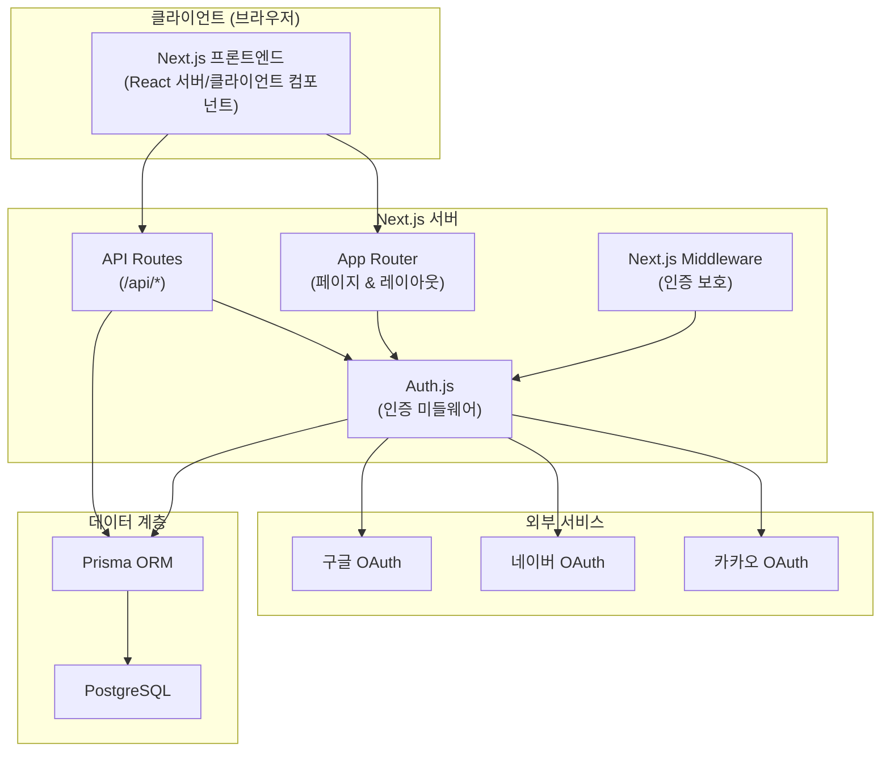
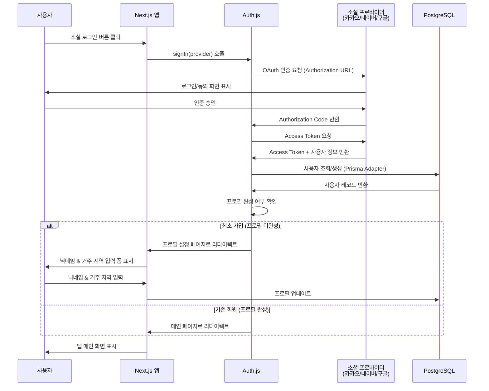
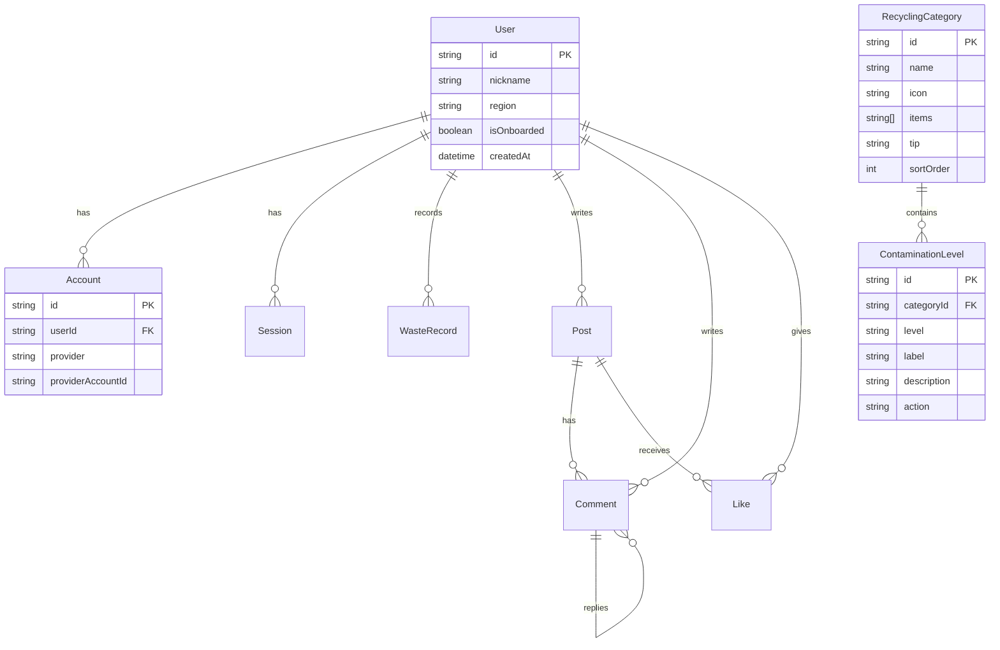

# 기술 설계 문서: 서울시 일반쓰레기 줄이기 트래커

## 개요 (Overview)

서울시 일반쓰레기 줄이기 트래커는 시민들이 올바른 분리배출을 실천하고 배출량을 추적할 수 있도록 돕는 모바일 웹 애플리케이션입니다.

### Phase 1 범위

- **회원 가입**: 카카오/네이버/구글 소셜 로그인, 닉네임 및 거주 지역 설정, 프로필 관리, 회원 탈퇴
- **분리배출 가이드**: 6개 재활용 카테고리별 오염도 3단계 처리 방법 안내, 아코디언 UI
- **배출량 기록**: 월별 요약 대시보드, 배출 기록 입력 폼 (날짜/무게/종량제봉투/사진/메모), 배출 타임라인

### Phase 2 범위 (향후 확장)

- 비교 & 랭킹 (사용자 비교, 랭킹 테이블, 목표 설정)
- 소통 & 팁 (커뮤니티 피드, 글쓰기, 좋아요/댓글)
- 현황 & 단체 대시보드 (공공 데이터 API 연동)

### 기술 스택
| 영역 | 기술 | 선택 근거 |
|------|------|-----------|
| 프론트엔드 | Next.js 14 (App Router) + TypeScript | SSR/SSG 지원, 파일 기반 라우팅, React 서버 컴포넌트 |
| UI 프레임워크 | Tailwind CSS | 모바일 우선 반응형 디자인, 유틸리티 기반 빠른 스타일링 |
| 인증 | Auth.js (NextAuth v5) | 카카오/네이버/구글 빌트인 프로바이더, Prisma Adapter 지원 |
| ORM | Prisma | 타입 안전 쿼리, 마이그레이션 관리, Auth.js 어댑터 제공 |
| 데이터베이스 | PostgreSQL | 관계형 데이터, 집계 쿼리, 랭킹 정렬에 적합 |
| 테스트 | Vitest + fast-check | 단위 테스트 + 속성 기반 테스트(PBT) |

### 리서치 요약
- **Auth.js (NextAuth v5)**: 카카오(`KakaoProvider`), 네이버(`NaverProvider`), 구글(`GoogleProvider`)을 빌트인 프로바이더로 지원합니다. Prisma Adapter를 통해 세션과 계정 정보를 PostgreSQL에 자동 저장할 수 있습니다. ([Auth.js 공식 문서](https://authjs.dev/getting-started/providers/kakao))
- **Prisma + PostgreSQL + Next.js**: Prisma ORM은 Next.js App Router와 잘 통합되며, 타입 안전한 데이터베이스 접근을 제공합니다. 단, Prisma Client는 Node.js 네이티브 바이너리를 사용하므로 **Edge Runtime(미들웨어)에서는 동작하지 않습니다**. 미들웨어에서 인증이 필요한 경우 JWT 세션 전략을 사용해야 합니다. ([Prisma 공식 가이드](https://www.prisma.io/docs/guides/authentication/authjs/nextjs))
- **OAuth 플로우**: 각 소셜 서비스의 개발자 콘솔에서 앱을 등록하고, Client ID/Secret을 발급받아 Auth.js에 설정합니다. 콜백 URL 패턴은 `{도메인}/api/auth/callback/{provider}`입니다.


## 아키텍처 (Architecture)

### 시스템 아키텍처 다이어그램



### 인증 플로우 (OAuth 소셜 로그인)



### 페이지 라우팅 구조

```
app/
├── (auth)/                    # 인증 관련 (로그인 필요 없음)
│   ├── login/page.tsx         # 로그인 페이지
│   └── onboarding/page.tsx    # 최초 프로필 설정
├── (main)/                    # 메인 앱 (로그인 필요)
│   ├── layout.tsx             # 네비게이션 탭 포함 레이아웃
│   ├── dashboard/page.tsx     # 현황 & 단체 (Phase 2)
│   ├── guide/page.tsx         # 분리배출 가이드
│   ├── log/page.tsx           # 배출량 기록
│   ├── ranking/page.tsx       # 비교 & 랭킹 (Phase 2)
│   ├── community/page.tsx     # 소통 & 팁 (Phase 2)
│   └── profile/page.tsx       # 프로필 설정
├── api/
│   └── auth/[...nextauth]/    # Auth.js API 라우트
│       └── route.ts
├── layout.tsx                 # 루트 레이아웃
└── middleware.ts              # 인증 미들웨어
```


## 컴포넌트 및 인터페이스 (Components and Interfaces)

### Phase 1 핵심 컴포넌트

#### 1. 인증 모듈

> **Edge Runtime 제약사항**: Next.js 미들웨어는 Edge Runtime에서 실행되며, Edge Runtime은 Node.js 네이티브 API(파일 시스템, TCP 소켓 등)를 지원하지 않습니다. Prisma Client는 내부적으로 Node.js 네이티브 바이너리를 사용하여 DB에 연결하므로 Edge Runtime에서 동작하지 않습니다. 따라서 **JWT 세션 전략**을 사용하여 미들웨어에서는 DB 호출 없이 JWT 토큰만으로 인증을 처리합니다. API 라우트와 서버 컴포넌트는 Node.js Runtime에서 실행되므로 Prisma가 정상 동작합니다.

```typescript
// auth.ts — Auth.js 설정 (JWT 세션 전략)
import NextAuth from "next-auth";
import KakaoProvider from "next-auth/providers/kakao";
import NaverProvider from "next-auth/providers/naver";
import GoogleProvider from "next-auth/providers/google";
import { PrismaAdapter } from "@auth/prisma-adapter";
import { prisma } from "@/lib/prisma";

export const { handlers, auth, signIn, signOut } = NextAuth({
  adapter: PrismaAdapter(prisma),
  // JWT 세션 전략 — Edge Runtime(미들웨어) 호환
  session: { strategy: "jwt" },
  providers: [
    KakaoProvider({ clientId: "...", clientSecret: "..." }),
    NaverProvider({ clientId: "...", clientSecret: "..." }),
    GoogleProvider({ clientId: "...", clientSecret: "..." }),
  ],
  callbacks: {
    // JWT 콜백: 토큰에 사용자 ID와 온보딩 완료 여부 포함
    async jwt({ token, user, trigger }) { /* ... */ },
    // 세션 콜백: JWT 토큰 정보를 세션 객체에 전달
    async session({ session, token }) { /* ... */ },
  },
  pages: {
    signIn: "/login",
    newUser: "/onboarding",
  },
});
```

#### 2. 미들웨어 (인증 보호)

```typescript
// middleware.ts — Edge Runtime에서 실행
// JWT 토큰 기반 인증 확인 (Prisma 호출 없음)
// - 로그인하지 않은 사용자 → /login 리다이렉트
// - 프로필 미완성 사용자 → /onboarding 리다이렉트
// - /login, /onboarding, /api/auth 경로는 인증 불필요
```

#### 3. 프론트엔드 컴포넌트 구조

```
components/
├── auth/
│   ├── SocialLoginButtons.tsx    # 카카오/네이버/구글 로그인 버튼
│   └── OnboardingForm.tsx        # 닉네임 & 거주 지역 설정 폼
├── profile/
│   ├── ProfileForm.tsx           # 프로필 수정 폼
│   ├── AccountInfo.tsx           # 연결된 소셜 계정 정보
│   └── DeleteAccountDialog.tsx   # 회원 탈퇴 확인 다이얼로그
├── guide/
│   ├── GuideHeader.tsx           # 안내 문구 & 오염도 기준 설명
│   ├── GuideTabs.tsx             # "분리배출 가이드" / "배출량 입력" 탭
│   ├── CategoryAccordion.tsx     # 카테고리 아코디언 카드
│   └── ContaminationLevel.tsx    # 오염도 단계별 처리 방법
├── log/
│   ├── MonthlySummary.tsx        # 월별 요약 대시보드 (총 무게/봉투 합계/기록 횟수)
│   ├── MonthNavigator.tsx        # 월 이동 화살표 (이전/다음 월)
│   ├── WasteRecordForm.tsx       # 배출 기록 입력 폼
│   ├── BagSizeSelector.tsx       # 종량제봉투 크기/개수 선택
│   ├── PhotoUpload.tsx           # 사진 업로드 (카메라/갤러리)
│   └── WasteTimeline.tsx         # 배출 타임라인 (월별 기록 리스트)
├── layout/
│   ├── NavigationTabs.tsx        # 상단 5개 네비게이션 탭 + 설정 아이콘
│   └── MobileLayout.tsx          # 모바일 우선 반응형 레이아웃
└── ui/
    ├── Accordion.tsx             # 범용 아코디언 컴포넌트
    ├── Dropdown.tsx              # 드롭다운 선택 컴포넌트
    └── Dialog.tsx                # 확인 다이얼로그 컴포넌트
```

### API 엔드포인트 설계

#### 인증 API (Auth.js 자동 생성)

| 메서드 | 경로 | 설명 |
|--------|------|------|
| GET/POST | `/api/auth/[...nextauth]` | Auth.js 핸들러 (로그인, 콜백, 세션 등) |

#### 사용자 프로필 API

| 메서드 | 경로 | 설명 | 요청 본문 |
|--------|------|------|-----------|
| GET | `/api/profile` | 현재 사용자 프로필 조회 | — |
| PUT | `/api/profile` | 프로필 업데이트 (닉네임, 거주 지역) | `{ nickname: string, region: string }` |
| POST | `/api/profile/onboarding` | 최초 프로필 설정 완료 | `{ nickname: string, region: string }` |
| DELETE | `/api/profile` | 회원 탈퇴 (계정 및 모든 데이터 삭제) | — |

#### 분리배출 가이드 API

| 메서드 | 경로 | 설명 |
|--------|------|------|
| GET | `/api/guide/categories` | 전체 카테고리 목록 조회 |
| GET | `/api/guide/categories/[id]` | 특정 카테고리 상세 (오염도별 처리 방법) |

#### 배출량 기록 API

| 메서드 | 경로 | 설명 | 요청 본문 |
|--------|------|------|-----------|
| GET | `/api/waste-records?month=2026-04` | 월별 배출 기록 목록 조회 | — |
| GET | `/api/waste-records/summary?month=2026-04` | 월별 요약 (총 무게, 봉투 합계, 기록 횟수) | — |
| POST | `/api/waste-records` | 배출 기록 생성 | `{ date: string, weightKg: number, bags: object, memo?: string }` |
| POST | `/api/waste-records/photo` | 종량제봉투 사진 업로드 | `FormData (file)` |

### 인터페이스 정의

```typescript
// 사용자 프로필 관련
interface UserProfile {
  id: string;
  nickname: string | null;
  region: string | null;       // 17개 광역시/도 중 하나
  isOnboarded: boolean;        // 프로필 설정 완료 여부
  socialProvider: string;      // "kakao" | "naver" | "google"
  createdAt: Date;
  updatedAt: Date;
}

interface ProfileUpdateRequest {
  nickname: string;            // 1~20자, 공백만으로 구성 불가
  region: string;              // VALID_REGIONS 중 하나
}

// 분리배출 가이드 관련
interface RecyclingCategory {
  id: string;
  name: string;                // "플라스틱" | "비닐" | "종이" | "스티로폼" | "유리" | "캔"
  icon: string;                // 카테고리 아이콘
  items: string[];             // 품목 예시 목록
  tip: string;                 // 실용적 TIP
  levels: ContaminationLevel[];
}

interface ContaminationLevel {
  level: "low" | "medium" | "high";  // 약한/중간/심한
  label: string;               // "🟢 약한 오염" | "🟡 중간 오염" | "🔴 심한 오염"
  description: string;         // 오염도 설명
  action: string;              // 처리 방법
}

// 거주 지역 상수
const VALID_REGIONS = [
  "서울특별시", "부산광역시", "대구광역시", "인천광역시",
  "광주광역시", "대전광역시", "울산광역시", "세종특별자치시",
  "경기도", "강원특별자치도", "충청북도", "충청남도",
  "전북특별자치도", "전라남도", "경상북도", "경상남도",
  "제주특별자치도"
] as const;

// 배출량 기록 관련
interface WasteRecord {
  id: string;
  userId: string;
  date: string;                // "YYYY-MM-DD"
  weightKg: number;            // 무게 (kg, 소수점 2자리)
  bags: BagCounts;             // 종량제봉투 크기별 개수
  photoUrl: string | null;     // 사진 URL
  memo: string | null;         // 메모
  createdAt: Date;
}

interface BagCounts {
  "5L": number;
  "10L": number;
  "20L": number;
  "30L": number;
  "50L": number;
}

interface WasteRecordCreateRequest {
  date: string;                // "YYYY-MM-DD"
  weightKg: number;            // 0 초과
  bags: BagCounts;             // 각 값 >= 0, 최소 하나는 > 0 (무게가 0이면)
  memo?: string;
}

interface MonthlySummary {
  month: string;               // "YYYY-MM"
  totalWeightKg: number;       // 월별 총 무게
  totalBags: number;           // 월별 종량제봉투 합계
  recordCount: number;         // 월별 기록 횟수
}

const VALID_BAG_SIZES = ["5L", "10L", "20L", "30L", "50L"] as const;
```


## 데이터 모델 (Data Models)

### PostgreSQL 스키마 (Prisma Schema)

```prisma
// schema.prisma

generator client {
  provider = "prisma-client-js"
}

datasource db {
  provider = "postgresql"
  url      = env("DATABASE_URL")
}

// ===== Auth.js 필수 모델 =====

model User {
  id            String    @id @default(cuid())
  name          String?
  email         String?   @unique
  emailVerified DateTime?
  image         String?

  // 앱 커스텀 필드
  nickname      String?   @db.VarChar(20)
  region        String?   @db.VarChar(20)
  isOnboarded   Boolean   @default(false)

  accounts      Account[]
  sessions      Session[]

  // Phase 2 관계
  wasteRecords  WasteRecord[]
  posts         Post[]
  comments      Comment[]
  likes         Like[]

  createdAt     DateTime  @default(now())
  updatedAt     DateTime  @updatedAt

  @@map("users")
}

model Account {
  id                String  @id @default(cuid())
  userId            String
  type              String
  provider          String  // "kakao" | "naver" | "google"
  providerAccountId String
  refresh_token     String? @db.Text
  access_token      String? @db.Text
  expires_at        Int?
  token_type        String?
  scope             String?
  id_token          String? @db.Text
  session_state     String?

  user User @relation(fields: [userId], references: [id], onDelete: Cascade)

  @@unique([provider, providerAccountId])
  @@map("accounts")
}

model Session {
  id           String   @id @default(cuid())
  sessionToken String   @unique
  userId       String
  expires      DateTime

  user User @relation(fields: [userId], references: [id], onDelete: Cascade)

  @@map("sessions")
}

model VerificationToken {
  identifier String
  token      String   @unique
  expires    DateTime

  @@unique([identifier, token])
  @@map("verification_tokens")
}

// ===== 분리배출 가이드 모델 =====

model RecyclingCategory {
  id    String @id @default(cuid())
  name  String @unique @db.VarChar(20) // "플라스틱", "비닐", "종이", "스티로폼", "유리", "캔"
  icon  String @db.VarChar(10)
  items String[]                        // 품목 예시 배열
  tip   String @db.Text                 // 실용적 TIP

  levels ContaminationLevel[]

  sortOrder Int @default(0)             // 표시 순서

  @@map("recycling_categories")
}

model ContaminationLevel {
  id          String @id @default(cuid())
  categoryId  String
  level       String @db.VarChar(10)    // "low" | "medium" | "high"
  label       String @db.VarChar(20)    // "🟢 약한 오염" 등
  description String @db.Text           // 오염도 설명
  action      String @db.Text           // 처리 방법

  category RecyclingCategory @relation(fields: [categoryId], references: [id], onDelete: Cascade)

  @@unique([categoryId, level])
  @@map("contamination_levels")
}

// ===== 배출량 기록 모델 =====

model WasteRecord {
  id        String   @id @default(cuid())
  userId    String
  date      DateTime @db.Date
  weightKg  Decimal  @db.Decimal(6, 2)
  bags      Json?    // { "5L": 0, "10L": 1, "20L": 0, "30L": 0, "50L": 0 }
  photoUrl  String?  @db.Text
  memo      String?  @db.Text

  user User @relation(fields: [userId], references: [id], onDelete: Cascade)

  createdAt DateTime @default(now())

  @@index([userId, date])
  @@map("waste_records")
}

model Post {
  id       String   @id @default(cuid())
  userId   String
  category String   @db.VarChar(10) // "tip" | "proof" | "free"
  content  String   @db.Text

  user     User      @relation(fields: [userId], references: [id], onDelete: Cascade)
  comments Comment[]
  likes    Like[]

  createdAt DateTime @default(now())

  @@index([category])
  @@map("posts")
}

model Comment {
  id       String  @id @default(cuid())
  postId   String
  userId   String
  parentId String? // 대댓글인 경우 부모 댓글 ID
  content  String  @db.Text

  post     Post      @relation(fields: [postId], references: [id], onDelete: Cascade)
  user     User      @relation(fields: [userId], references: [id], onDelete: Cascade)
  parent   Comment?  @relation("CommentReplies", fields: [parentId], references: [id])
  replies  Comment[] @relation("CommentReplies")

  createdAt DateTime @default(now())

  @@map("comments")
}

model Like {
  id     String @id @default(cuid())
  postId String
  userId String

  post Post @relation(fields: [postId], references: [id], onDelete: Cascade)
  user User @relation(fields: [userId], references: [id], onDelete: Cascade)

  @@unique([postId, userId])
  @@map("likes")
}
```

### ER 다이어그램



### 시드 데이터 구조 (분리배출 가이드)

분리배출 가이드 데이터는 DB 시드(seed)로 초기 투입합니다. 6개 카테고리 × 3단계 오염도 = 18개 처리 방법 레코드가 생성됩니다.

```typescript
// 시드 데이터 예시
const categories = [
  {
    name: "플라스틱",
    icon: "♻️",
    items: ["트레이", "PP용기", "페트병", "세제 용기"],
    tip: "라벨을 제거하고 내용물을 비운 후 배출하세요",
    levels: [
      { level: "low", label: "🟢 약한 오염", description: "물·세제로 씻길 정도", action: "세척 후 재활용 배출" },
      { level: "medium", label: "🟡 중간 오염", description: "기름기·음식물 잔여", action: "오염물질 제거 후 재활용 배출" },
      { level: "high", label: "🔴 심한 오염", description: "씻어도 사라지지 않는 오염", action: "일반 쓰레기 배출" },
    ],
  },
  // ... 비닐, 종이, 스티로폼, 유리, 캔
];
```


## 정확성 속성 (Correctness Properties)

*속성(property)은 시스템의 모든 유효한 실행에서 참이어야 하는 특성 또는 동작입니다. 속성은 사람이 읽을 수 있는 명세와 기계가 검증할 수 있는 정확성 보장 사이의 다리 역할을 합니다.*

### Property 1: 프로필 유효성 검증 — 닉네임과 거주 지역이 모두 유효해야 온보딩 완료

*For any* 닉네임과 거주 지역 조합에 대해, 닉네임이 1~20자의 비공백 문자열이고 거주 지역이 17개 광역시/도 목록에 포함된 경우에만 온보딩이 성공하며, 그 외의 경우(빈 문자열, 공백만 있는 문자열, 유효하지 않은 지역 등)에는 온보딩이 거부된다.

**Validates: Requirements 1.6**

### Property 2: 아코디언 카드 수 일치 — 카테고리 수만큼 아코디언 카드가 렌더링됨

*For any* RecyclingCategory 배열에 대해, 렌더링된 아코디언 카드의 수는 입력 카테고리 배열의 길이와 동일하다.

**Validates: Requirements 6.1**

### Property 3: 아코디언 펼침 시 오염도 단계 완전 표시

*For any* RecyclingCategory에 대해, 아코디언을 펼쳤을 때 해당 카테고리의 모든 ContaminationLevel이 표시되며, 각 레벨의 action 필드가 비어있지 않다.

**Validates: Requirements 6.2, 6.4**

### Property 4: 오염도 레벨-아이콘 매핑 정확성

*For any* ContaminationLevel에 대해, level 값이 "low"이면 label에 "🟢"이, "medium"이면 "🟡"이, "high"이면 "🔴"이 포함된다.

**Validates: Requirements 6.3**

### Property 5: 카테고리 데이터 완전성

*For any* RecyclingCategory에 대해, items 배열이 비어있지 않고, tip 필드가 비어있지 않으며, levels 배열에 3개의 오염도 단계(low, medium, high)가 모두 포함된다.

**Validates: Requirements 6.5, 6.6**

### Property 6: 아코디언 토글 라운드트립

*For any* 아코디언 상태에서, 토글을 두 번 수행하면(펼치고 접기, 또는 접고 펼치기) 원래 상태로 돌아간다.

**Validates: Requirements 6.7**

### Property 7: 데이터 직렬화 라운드트립 — 배출량 기록

*For any* 유효한 배출량 기록(WasteRecord) 객체에 대해, JSON으로 직렬화한 후 역직렬화하면 원본과 동일한 객체가 생성된다.

**Validates: Requirements 16.3**

### Property 8: 데이터 직렬화 라운드트립 — 커뮤니티 피드

*For any* 유효한 커뮤니티 피드 데이터(Post, Comment, Like)에 대해, JSON으로 직렬화한 후 역직렬화하면 원본과 동일한 데이터가 생성된다.

**Validates: Requirements 16.6**

### Property 9: 월별 집계 정확성

*For any* 배출량 기록(WasteRecord) 배열에 대해, 월별 총 무게는 해당 월 기록들의 weightKg 합과 동일하고, 월별 기록 횟수는 해당 월 기록 배열의 길이와 동일하다.

**Validates: Requirements 17.4, 17.5, 17.6**

### Property 10: 랭킹 정렬 정확성 및 원소 보존

*For any* 참여자 목록에 대해, 배출량 기준 오름차순 정렬 후 (1) 모든 인접 쌍에서 앞 참여자의 배출량이 뒤 참여자의 배출량 이하이고, (2) 정렬 전후 모든 참여자가 목록에 존재한다.

**Validates: Requirements 18.2, 18.3, 18.4, 18.5**

### Property 11: 카테고리 필터 정확성

*For any* 게시글(Post) 목록과 카테고리 필터에 대해, 필터링된 결과의 모든 게시글은 선택된 카테고리에 속한다.

**Validates: Requirements 19.3**

### Property 12: 카테고리 필터 분할 보존

*For any* 게시글(Post) 목록에 대해, "전체" 필터 적용 시 결과 수는 원본과 동일하며, 각 카테고리별 필터 결과 수의 합은 전체 게시글 수와 동일하다.

**Validates: Requirements 19.4, 19.5**


## 오류 처리 (Error Handling)

### 인증 오류

| 오류 상황 | 처리 방법 |
|-----------|-----------|
| OAuth 인증 실패 (프로바이더 오류) | 로그인 페이지로 리다이렉트, "로그인에 실패했습니다. 다시 시도해주세요." 메시지 표시 |
| OAuth 인증 취소 (사용자 취소) | 로그인 페이지로 리다이렉트, "로그인이 취소되었습니다." 메시지 표시 |
| 세션 만료 | 자동으로 로그인 페이지로 리다이렉트 |
| 프로필 미완성 상태에서 메인 접근 | /onboarding 페이지로 리다이렉트 |

### 프로필 관리 오류

| 오류 상황 | 처리 방법 |
|-----------|-----------|
| 닉네임 빈 문자열 또는 공백만 입력 | "닉네임을 입력해주세요." 인라인 오류 메시지 |
| 닉네임 20자 초과 | "닉네임은 20자 이내로 입력해주세요." 인라인 오류 메시지 |
| 거주 지역 미선택 | "거주 지역을 선택해주세요." 인라인 오류 메시지 |
| 프로필 업데이트 API 실패 | "프로필 저장에 실패했습니다. 다시 시도해주세요." 토스트 메시지 |
| 회원 탈퇴 API 실패 | "탈퇴 처리에 실패했습니다. 다시 시도해주세요." 토스트 메시지 |

### 분리배출 가이드 오류

| 오류 상황 | 처리 방법 |
|-----------|-----------|
| 가이드 데이터 로딩 실패 | "가이드 정보를 불러오는 데 실패했습니다." 메시지 + 재시도 버튼 |
| 네트워크 오류 | "네트워크 연결을 확인해주세요." 메시지 |

### 배출량 기록 오류

| 오류 상황 | 처리 방법 |
|-----------|-----------|
| 필수 입력 필드 누락 (날짜, 무게/봉투) | 해당 필드에 인라인 오류 메시지 표시, 저장 차단 |
| 무게에 숫자 외 문자 입력 | "숫자만 입력 가능합니다." 인라인 오류 메시지 |
| 종량제봉투 개수 음수 시도 | 최솟값 0으로 제한 (- 버튼 비활성화) |
| 사진 업로드 실패 | "사진 업로드에 실패했습니다. 다시 시도해주세요." 토스트 메시지 |
| 기록 저장 API 실패 | "기록 저장에 실패했습니다. 다시 시도해주세요." 토스트 메시지 |
| 미래 날짜 선택 시도 | 날짜 피커에서 미래 날짜 선택 불가 처리 |

### 데이터 직렬화 오류 (Phase 2)

| 오류 상황 | 처리 방법 |
|-----------|-----------|
| JSON 파싱 실패 (손상된 데이터) | 오류를 콘솔에 로그, 기본값으로 초기화 |
| 유효하지 않은 데이터 구조 | Zod 스키마 검증 실패 시 기본값으로 초기화 |

### 공통 오류 처리 패턴

```typescript
// 서버 액션 / API 라우트 공통 에러 응답 형식
interface ApiErrorResponse {
  success: false;
  error: {
    code: string;       // "VALIDATION_ERROR" | "AUTH_ERROR" | "NOT_FOUND" | "INTERNAL_ERROR"
    message: string;    // 사용자에게 표시할 한국어 메시지
  };
}

interface ApiSuccessResponse<T> {
  success: true;
  data: T;
}

type ApiResponse<T> = ApiSuccessResponse<T> | ApiErrorResponse;
```

## 테스트 전략 (Testing Strategy)

### 이중 테스트 접근법

이 프로젝트는 **단위 테스트(unit tests)**와 **속성 기반 테스트(property-based tests)**를 병행하여 포괄적인 테스트 커버리지를 확보합니다.

### 테스트 도구

| 도구 | 용도 |
|------|------|
| Vitest | 테스트 러너 및 단위 테스트 프레임워크 |
| fast-check | 속성 기반 테스트(PBT) 라이브러리 |
| React Testing Library | 컴포넌트 렌더링 테스트 |
| MSW (Mock Service Worker) | API 모킹 |

### 단위 테스트 (Example-Based)

Phase 1 범위에서 단위 테스트로 검증할 항목:

- **로그인 페이지**: 3개 소셜 로그인 버튼 렌더링 확인 (요구사항 1.1)
- **온보딩 리다이렉트**: isOnboarded=false 시 /onboarding 리다이렉트 (요구사항 1.5)
- **인증 보호**: 세션 없이 보호된 경로 접근 시 /login 리다이렉트 (요구사항 1.10)
- **거주 지역 드롭다운**: 17개 항목 표시 확인 (요구사항 1.7)
- **인증 실패 처리**: 에러 시 로그인 페이지 + 에러 메시지 (요구사항 1.8)
- **프로필 UI 요소**: 닉네임/거주 지역 변경, 소셜 계정 정보, 로그아웃/탈퇴 버튼 (요구사항 2.1~2.8)
- **회원 탈퇴 다이얼로그**: 확인/취소 동작 (요구사항 2.7, 2.10)
- **가이드 페이지 UI**: 안내 문구, 오염도 기준, 탭 표시 (요구사항 5.1~5.5)
- **월별 요약 대시보드**: 3가지 지표 표시, 월 이동 화살표, 미래 월 비활성화 (요구사항 7.1~7.5)
- **배출 기록 입력 폼**: 필드 렌더링, 종량제봉투 +/- 버튼, 필수 입력 검증, 저장 동작 (요구사항 8.1~8.9)
- **배출 타임라인**: 기록 표시, 빈 상태 메시지, 월 변경 시 갱신 (요구사항 9.1~9.5)

### 속성 기반 테스트 (Property-Based)

속성 기반 테스트는 `fast-check` 라이브러리를 사용하며, 각 테스트는 최소 100회 반복 실행됩니다.

| 속성 | 테스트 대상 | 태그 |
|------|------------|------|
| Property 1 | 프로필 유효성 검증 함수 | Feature: seoul-waste-reduction-tracker, Property 1: 프로필 유효성 검증 |
| Property 2 | CategoryAccordion 렌더링 | Feature: seoul-waste-reduction-tracker, Property 2: 아코디언 카드 수 일치 |
| Property 3 | 아코디언 펼침 시 레벨 표시 | Feature: seoul-waste-reduction-tracker, Property 3: 아코디언 펼침 시 오염도 단계 완전 표시 |
| Property 4 | 오염도 레벨-아이콘 매핑 | Feature: seoul-waste-reduction-tracker, Property 4: 오염도 레벨-아이콘 매핑 정확성 |
| Property 5 | 카테고리 데이터 검증 | Feature: seoul-waste-reduction-tracker, Property 5: 카테고리 데이터 완전성 |
| Property 6 | 아코디언 토글 상태 | Feature: seoul-waste-reduction-tracker, Property 6: 아코디언 토글 라운드트립 |
| Property 7 | WasteRecord 직렬화 | Feature: seoul-waste-reduction-tracker, Property 7: 데이터 직렬화 라운드트립 — 배출량 기록 |
| Property 8 | 커뮤니티 피드 직렬화 | Feature: seoul-waste-reduction-tracker, Property 8: 데이터 직렬화 라운드트립 — 커뮤니티 피드 |
| Property 9 | 월별 집계 함수 | Feature: seoul-waste-reduction-tracker, Property 9: 월별 집계 정확성 |
| Property 10 | 랭킹 정렬 함수 | Feature: seoul-waste-reduction-tracker, Property 10: 랭킹 정렬 정확성 및 원소 보존 |
| Property 11 | 카테고리 필터 함수 | Feature: seoul-waste-reduction-tracker, Property 11: 카테고리 필터 정확성 |
| Property 12 | 카테고리 필터 분할 | Feature: seoul-waste-reduction-tracker, Property 12: 카테고리 필터 분할 보존 |

### 통합 테스트

- **OAuth 플로우**: Auth.js 콜백에서 사용자 생성/조회 동작 (요구사항 1.3, 1.4)
- **회원 탈퇴**: Cascade 삭제로 모든 관련 데이터 삭제 확인 (요구사항 2.9)
- **세션 관리**: 세션 토큰 기반 자동 로그인 (요구사항 1.9)

### 테스트 구조

```
__tests__/
├── unit/
│   ├── auth/
│   │   ├── login-page.test.tsx        # 로그인 페이지 렌더링
│   │   └── onboarding-form.test.tsx   # 온보딩 폼 동작
│   ├── profile/
│   │   ├── profile-form.test.tsx      # 프로필 수정 폼
│   │   └── delete-dialog.test.tsx     # 탈퇴 다이얼로그
│   └── guide/
│       ├── guide-header.test.tsx      # 가이드 헤더
│       └── accordion.test.tsx         # 아코디언 동작
│   └── log/
│       ├── monthly-summary.test.tsx   # 월별 요약 대시보드
│       ├── waste-record-form.test.tsx # 배출 기록 입력 폼
│       ├── bag-size-selector.test.tsx # 종량제봉투 선택
│       └── waste-timeline.test.tsx    # 배출 타임라인
├── property/
│   ├── profile-validation.prop.test.ts    # Property 1
│   ├── accordion-rendering.prop.test.ts   # Property 2, 3, 6
│   ├── contamination-level.prop.test.ts   # Property 4, 5
│   ├── serialization.prop.test.ts         # Property 7, 8
│   ├── monthly-aggregation.prop.test.ts   # Property 9
│   ├── ranking-sort.prop.test.ts          # Property 10
│   └── category-filter.prop.test.ts       # Property 11, 12
└── integration/
    ├── auth-flow.test.ts              # OAuth 통합 테스트
    └── account-deletion.test.ts       # 회원 탈퇴 통합 테스트
```
